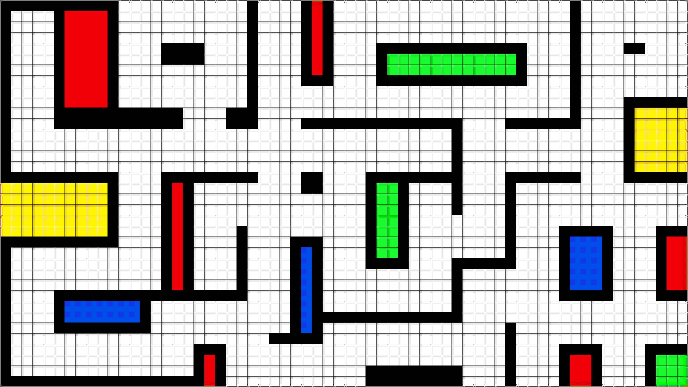
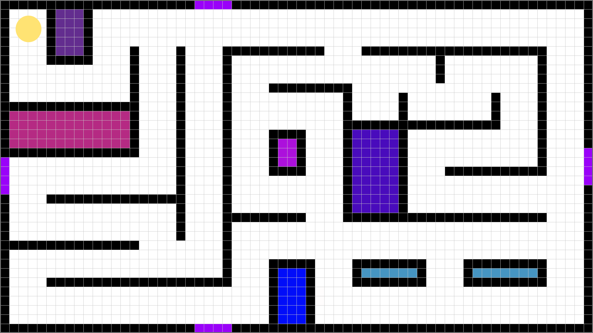

# roguePacman

## concept

Het doel van rogue Pacman is zo lang als mogelijk overleven door het ontwijken van de enemies.
maar hoe doe je dat?
hoelanger je speelt hoe meer upgrades je kan kopen door middel van coins. 
door deze upgrade kan je sneller worden sterker worden of andere coole abilies unlocken.

## Ontwerp Keuzes

### Hoe communiceer ik dat de player kan bewegen?
de standaard WASD movement zorgt er voor dat de speler er snel genoeg achter komt hoe de momement werkt

### Hoe communiceer ik wat het doel van het level is?
Alle orbs verzamelen en spenderen aan upgrades.

### Hoe communiceer ik wat gevaarlijk is?
Trail And error/ enemies knipperen rood bij de start van het lvl om gevaar te laten zien

## Noahs level 1 design.

## Cady's level 2 design.

